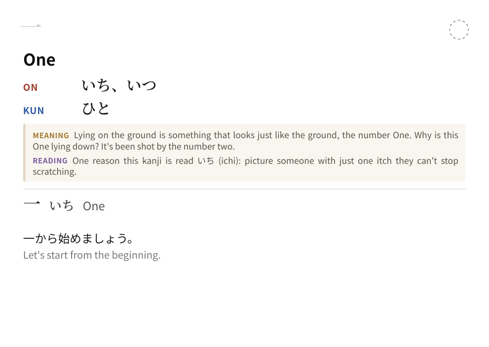
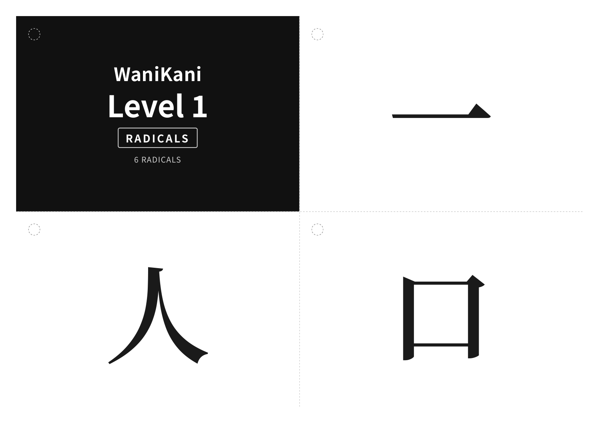

# WaniKani Kanji-Karteikarten

CLI-Tool (Python 3), das aus einem **WaniKani-Level** doppelseitig bedruckbare
**Karteikarten als PDF** erzeugt – wahlweise für die **Kanji** oder die
**Radicals** des Levels (`--type`).

**Kanji-Karten**

- **Vorderseite:** nur das Kanji, groß und zentriert.
- **Rückseite:** Bedeutungen · Lesungen (On/Kun) · **Eselsbrücken** (Mnemonic
  & Reading) · eine Beispielvokabel mit Lesung · ein Beispielsatz mit Übersetzung.

**Radical-Karten** (`--type radicals`)

- **Vorderseite:** das Radical (Zeichen, oder – falls kein Unicode-Zeichen
  existiert – das WaniKani-Bild).
- **Rückseite:** Bedeutung · **Mnemonic** · (falls vorhanden) das Radical-Bild ·
  eine Liste der ersten zugehörigen Kanji mit Lesung und Bedeutung.

## Druck-Layouts (`--layout`)

| Layout | Beschreibung |
|---|---|
| `a4-4up` (Default) | 4 Karten pro **A4-Blatt** (quer). Nur die mittige Kreuzlinie wird geschnitten → 4 Karten. |
| `a6` | **Eine Karte pro A6-Seite** (quer). Zum **direkten Bedrucken von A6-Karten** – kein Schneiden. |

Weitere Eigenschaften:

- **Deckkarte** (schwarz-weiß) als erste Karte: vorne „WaniKani – Level N" mit
  Untertitel **Kanji** bzw. **Radicals**, hinten eine Übersicht aller Einträge
  mit Bedeutung. Abschaltbar mit `--no-cover`.
- **Lochbereich oben links** auf jeder Karte (mit dezenter Loch-Markierung) –
  zum Lochen und Aufhängen an einem Ring. Der Bereich ist auf der Rückseite
  spiegelbildlich reserviert, sodass ein einziges Loch durch beide Seiten passt.
- Beim `a4-4up`-Layout wird zusätzlich die mittige Kreuzlinie als einzige
  Schnittkante gedruckt.
- Die Rückseite wird für den Duplexdruck automatisch gespiegelt, sodass
  Vorder- und Rückseite exakt zusammenpassen.

## Vorschau

**A4, 4 Karten/Seite** (`--sample`, Standard):

| Vorderseite | Rückseite |
|---|---|
|  |  |

**A6, eine Karte/Seite** (`--sample --layout a6`):

| Deckkarte (vorne) | Kanji-Karte (hinten) |
|---|---|
|  |  |

**Radicals** (`--sample --type radicals`):

| Vorderseite | Rückseite |
|---|---|
|  |  |

Fertige PDFs: [`previews/sample_level1.pdf`](previews/sample_level1.pdf) (Kanji, A4) ·
[`previews/sample_a6.pdf`](previews/sample_a6.pdf) (A6) ·
[`previews/sample_radicals.pdf`](previews/sample_radicals.pdf) (Radicals).

## Setup

WeasyPrint benötigt die System-Libraries **Pango**, **Cairo** und
**GDK-PixBuf**. Unter Debian/Ubuntu:

```bash
sudo apt-get install libpango-1.0-0 libpangocairo-1.0-0 libcairo2 \
                     libgdk-pixbuf-2.0-0 libffi-dev
```

(macOS: `brew install pango cairo gdk-pixbuf libffi`. Details:
<https://doc.courtbouillon.org/weasyprint/stable/first_steps.html>)

Dann:

```bash
python -m venv .venv && source .venv/bin/activate
pip install -r requirements.txt
```

Die japanischen Schriften (Noto Serif JP / Noto Sans JP) liegen bereits unter
`fonts/` im Repo – es ist keine System-Schrift nötig.

## Verwendung

```bash
# WaniKani-Token holen: wanikani.com → Settings → API Tokens (read-only genügt)
export WANIKANI_API_TOKEN="…"

python kanji_cards.py 5                 # Level 5 → cards.pdf
python kanji_cards.py 5 -o level5.pdf   # eigener Dateiname
```

Alternativ kann der Token in einer `.env`-Datei stehen:

```
WANIKANI_API_TOKEN=…
```

### Ohne Token ausprobieren

```bash
python kanji_cards.py --sample                    # A4, Kanji (Level 1)
python kanji_cards.py --sample --type radicals    # Radicals statt Kanji
python kanji_cards.py --sample --layout a6        # A6, eine Karte pro Seite
```

### Optionen

| Option | Default | Beschreibung |
|---|---|---|
| `level` | – | WaniKani-Level (1–60) |
| `--output`, `-o` | `cards.pdf` | Ausgabedatei |
| `--type {kanji,radicals}` | `kanji` | Welcher Stapel exportiert wird |
| `--layout {a4-4up,a6}` | `a4-4up` | Druck-Layout (A4 4-fach mit Schnitt / A6 pro Karte) |
| `--duplex {long-edge,short-edge}` | `long-edge` | Wende-Kante für den Duplexdruck |
| `--paper {a4,letter}` | `a4` | Papierformat (nur für `a4-4up`) |
| `--font PFAD` | `fonts/NotoSerifJP-SemiBold.ttf` | Schrift für das große Kanji |
| `--no-cache` | – | API-Cache unter `.cache/` umgehen |
| `--no-cut-marks` | – | Schnitt-/Loch-Markierungen weglassen |
| `--no-cover` | – | keine Deckkarte (Titel + Kanji-Übersicht) voranstellen |
| `--sample` | – | Beispieldaten ohne API-Token verwenden |

## Drucken

Allgemein: PDF mit **beidseitigem Druck (Duplex)** und **Querformat** öffnen,
Wende-Option passend zu `--duplex` wählen (`long-edge` = lange Kante, Standard;
sonst `short-edge`) und **„Tatsächliche Größe“ / „100 %“** wählen (nicht „An
Seite anpassen“), damit die Geometrie exakt bleibt.

**Layout `a4-4up` (schneiden):**

1. Auf A4 drucken.
2. Jedes Blatt **einmal waagerecht und einmal senkrecht mittig** entlang der
   gestrichelten Kreuzlinie schneiden → 4 Karten.
3. Oben links (Vorderseite) an der Kreis-Markierung lochen und auf einen Ring
   ziehen.

**Layout `a6` (kein Schneiden):**

1. Im Druckdialog als Papierformat **A6** wählen und die A6-Karten einlegen.
2. Duplex drucken – jede Karte belegt genau eine A6-Seite, Vorder- und
   Rückseite liegen exakt übereinander.
3. Oben links (Vorderseite) an der Kreis-Markierung lochen und auf einen Ring
   ziehen.

Tipp: Vor dem Serienlauf eine Karte testen und Vorder-/Rückseite gegen das
Licht halten, um die Ausrichtung der Wende-Kante zu prüfen. Passt es nicht,
`--duplex short-edge` versuchen.

## Architektur

Ein Skript (`kanji_cards.py`), klar in Funktionen getrennt:

- **WaniKani-Client** – `fetch_kanji(level)`, `fetch_vocab(ids)` (Batch + Cache),
  `_request()` mit Auth-/Revision-Header und 429/5xx-Backoff.
- **Modell** – `build_card()`, `pick_example_vocab()` (Default: niedrigstes
  Vokabel-Level, bei Gleichstand das erste).
- **Layout** – `paginate()`, `mirror_backside()` (Duplex-Spiegelung),
  `render_pdf()` (Jinja2-Template → WeasyPrint).

Kanji-Objekte enthalten selbst **keine** Beispiele; die Vokabeln werden über
`amalgamation_subject_ids` **gebündelt** nachgeladen und gecacht.

## Tests

```bash
pip install pytest
pytest
```

Abgedeckt sind die Kernfunktionen `pick_example_vocab`, `mirror_backside`,
`paginate`, `build_card` und `strip_markup`.
