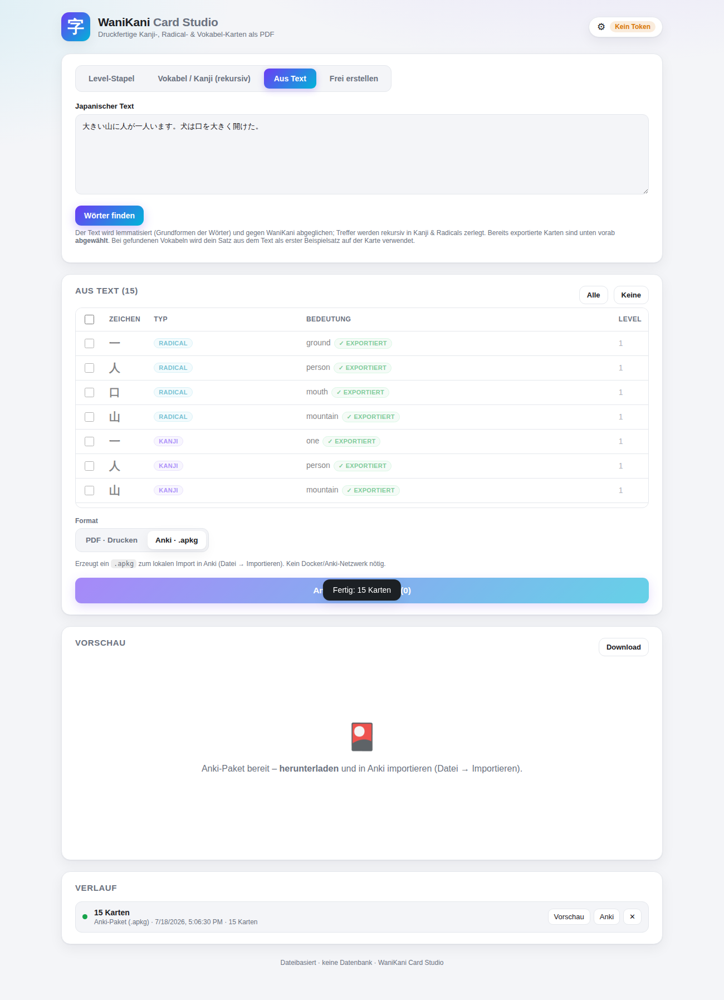

# WaniKani Kanji-Karteikarten

CLI-Tool (Python 3) **und Web-Frontend**, das aus einem **WaniKani-Level**
doppelseitig bedruckbare **Karteikarten als PDF** erzeugt – wahlweise für die
**Kanji** oder die **Radicals** des Levels (`--type`).

> **Web-Frontend & Docker:** Für die grafische Oberfläche (API-Token setzen,
> Level wählen, PDF-Vorschau, Verlauf) siehe [Web-Frontend (Docker)](#web-frontend-docker).

**Kanji-Karten**

- **Vorderseite:** nur das Kanji, groß und zentriert.
- **Rückseite:** das Kanji als Referenz (oben, etwas größer als der Text) ·
  Bedeutungen · Lesungen (On/Kun) · **Zusammensetzung** (die Radicals, aus denen
  das Kanji besteht, mit Bedeutung) · **Eselsbrücken** (Mnemonic & Reading) ·
  eine Beispielvokabel mit Lesung · **Beispielsätze** mit Übersetzung – WaniKani
  liefert pro Vokabel oft mehrere `context_sentences`; das PDF zeigt aus
  Platzgründen (feste Kartenhöhe) maximal **zwei**, der Anki-Export **alle**
  vorhandenen. Vokabel + Sätze können optional mit **Vertonung**
  (`vocab_audio_url` / `sentence_audio_url` je Satz auf der `Card`) versehen
  sein, die als abspielbarer Player **nur im Anki-Export** erscheint (im PDF
  ohne Wirkung, da Papier nicht abspielbar ist). Vokabel-Audio wird
  automatisch aus WaniKanis `pronunciation_audios` übernommen; für
  Beispielsätze liefert WaniKani selbst keine Vertonung – dieses Feld
  (`context_sentences[…].audios`, gleiches Schema) lässt sich manuell in den
  Subject-Daten nachtragen. Im Anki-Export werden diese Audio-URLs als echte
  MP3/OGG-Dateien heruntergeladen und direkt ins `.apkg` eingebettet (nicht
  nur verlinkt) – die Karten sind danach vollständig offline abspielbar, ganz
  ohne laufende Verbindung zu WaniKani.

**Radical-Karten**

- **Vorderseite:** das Radical (Zeichen, oder – falls kein Unicode-Zeichen
  existiert – das WaniKani-Bild).
- **Rückseite:** das Radical als Referenz (Zeichen oder Bild, oben) · Bedeutung ·
  **Mnemonic** · eine Liste der ersten zugehörigen Kanji mit Lesung und Bedeutung.

**Vokabel-Karten**

- **Vorderseite:** das Wort, groß (automatisch an die Länge angepasst).
- **Rückseite:** das Wort als Referenz (oben) · Bedeutungen · Wortart · Lesung ·
  optional die eigene **Vertonung** (Anki-Export, s. o.) · **Mnemonics** ·
  Beispielsätze (PDF max. zwei, Anki alle vorhandenen).

Im Anki-Export trägt jede Rückseite (Radical/Kanji/Vokabel) außerdem einen
dezenten Link **„WaniKani ↗"** zur Original-Seite des Subjects
(`document_url`) – nur dort, das PDF verzichtet darauf (ein Link auf Papier
wäre nutzlos).

Damit man zum Abfragen nicht umdrehen muss, steht das Zeichen der Vorderseite
(Kanji/Radical/Vokabel) **auch auf der Rückseite oben** – deutlich kleiner als
vorne, aber etwas größer als der übrige Text.

Jede **Vorderseite** trägt oben rechts schlichte **Tags** (Typ + WaniKani-Level,
z. B. `KANJI` / `LV 1`); die Rückseite zeigt – sofern ein Token gesetzt ist –
dezent unten rechts den **WaniKani-Benutzernamen**.

## Vier Wege zu den Karten (Web)

1. **Level-Stapel:** ein Level auflisten – per Checkbox **Radicals**, **Kanji**
   und/oder **Vokabeln** kombinieren (mehrere gleichzeitig möglich; alle drei
   angehakt exportiert den kompletten Levelinhalt in einem Rutsch).
2. **Vokabel / Kanji (rekursiv):** eine Vokabel oder ein Kanji suchen und über
   die **Komposition absteigen** – die enthaltenen Kanji und Radicals werden
   rekursiv mit aufgelöst (Vokabel → Kanji → Radicals). Mehrere Vokabeln
   nacheinander suchen und anklicken **hängt** deren Kompositionen an dieselbe
   Tabelle an (dedupliziert); **„Tabelle leeren“** setzt zurück.
3. **Aus Text:** einen kompletten japanischen Text einfügen (Artikel, Satz,
   Kapitel …). Der Text wird **lemmatisiert** ([Janome](https://github.com/mocobeta/janome),
   reines Python – jedes Wort auf seine Wörterbuch-Grundform zurückgeführt, z. B.
   „大きく" → „大きい") und die gefundenen Wörter gegen WaniKani abgeglichen;
   Treffer werden wie im Kompositions-Modus rekursiv in Kanji &amp; Radicals
   zerlegt. **Besonderheit:** Bei gefundenen Vokabeln wird der Original-Satz aus
   deinem Text als **erster Beispielsatz** auf der Karte verwendet (WaniKanis
   eigener Beispielsatz rutscht dafür als weiterer Satz nach hinten, geht also
   nicht verloren) – sowohl auf der eigenständigen Vokabel-Karte als auch im
   eingebetteten Beispiel einer Kanji-Karte, falls dieselbe Vokabel dort
   herangezogen wird.
4. **Frei erstellen:** eigene Karten in zwei **freien Rich-Text-Feldern**
   (Vorder- und Rückseite) anlegen – Text formatieren (fett/kursiv/unterstrichen,
   Titel, Merk-Box, Liste, große Schrift) und **Bilder** einfügen. Beide Felder
   starten mit einem **Layout-Vorschlag** (Vorderseite: groß & zentriert;
   Rückseite: Titel · Freitext · Merk-Box). Die **Tags** werden separat eingegeben
   und immer vorne oben rechts gedruckt. Optional aus WaniKani vorbefüllen.

Alle vier Wege füllen dieselbe **Tabelle**; dort wählt man ein oder mehrere
Elemente aus und erzeugt daraus **ein PDF** oder **Anki-Paket**.

**Bereits Exportiertes wird sich gemerkt:** Jede Zeile, deren Subject-ID schon
einmal in einem erfolgreich abgeschlossenen Export (PDF oder Anki, aus dem
**Verlauf**) enthalten war, wird in der Tabelle mit einem dezenten
„✓ exportiert"-Badge markiert und ist **standardmäßig abgewählt** – alles
andere bleibt wie gewohnt angehakt. Besonders im Text-Modus hilfreich: einen
zweiten Text einfügen, und nur die wirklich neuen Wörter sind vorausgewählt.
Betrifft alle vier Modi (nicht nur „Aus Text"), da es zentral über den
Job-Verlauf ermittelt wird – keine eigene Datenbank nötig.

## Druck-Layouts (`--layout`)

| Layout | Beschreibung |
|---|---|
| `a6` (Default) | **Eine Karte pro A6-Seite** (quer). Zum **direkten Bedrucken von A6-Karten** – kein Schneiden. |
| `a4-4up` | 4 Karten pro **A4-Blatt** (quer). Nur die mittige Kreuzlinie wird geschnitten → 4 Karten. |

Weitere Eigenschaften:

- **Optionales Stanzloch** (Default **aus**; `--hole` bzw. Toggle im Web): oben
  links auf der Vorderseite, mit dezenter Loch-Markierung zum Aufhängen an einem
  Ring. Der Bereich ist auf der Rückseite spiegelbildlich reserviert, sodass ein
  einziges Loch durch beide Seiten passt.
- Beim `a4-4up`-Layout wird die mittige Kreuzlinie als einzige Schnittkante
  gedruckt (abschaltbar mit `--no-cut-marks`).
- Jedes Layout funktioniert mit allen Kartentypen – mit `--layout a6` lässt sich
  jede Karte einzeln **ohne Schneiden** direkt auf A6-Karten drucken.
- Die Rückseite wird für den Duplexdruck automatisch gespiegelt, sodass
  Vorder- und Rückseite exakt zusammenpassen.

## Vorschau

**Kanji (A4, 4 Karten/Seite):**

| Vorderseite (mit Tags) | Rückseite |
|---|---|
|  |  |

**Rekursive Komposition** (Vokabel 一人 → Kanji 一, 人 → Radicals):

| Vorderseite | Rückseite |
|---|---|
|  |  |

Mehrere Vokabeln nacheinander gesucht und angeklickt – die Kompositionen hängen
sich an dieselbe Tabelle an (hier 一人 + 大きい, 8 Karten kombiniert):


**Aus Text:** ein Text eingefügt, lemmatisiert und rekursiv aufgelöst – alles
noch nicht Exportierte ist angehakt:


Denselben Text ein zweites Mal aufgelöst, nachdem die Karten bereits
exportiert wurden – alle Zeilen sind mit „✓ exportiert" markiert und
automatisch **abgewählt**:



**Radicals** und **A6 (eine Karte/Seite)**:

| Radical (hinten) | A6-Karte (hinten) |
|---|---|
|  |  |

**Frei erstellte Karte** (freier Inhalt, Tags vorne):

| Vorderseite | Rückseite |
|---|---|
|  |  |

Fertige PDFs: [`sample_level1.pdf`](previews/sample_level1.pdf) ·
[`sample_composition.pdf`](previews/sample_composition.pdf) ·
[`sample_radicals.pdf`](previews/sample_radicals.pdf) ·
[`sample_a6.pdf`](previews/sample_a6.pdf).

## Setup

WeasyPrint benötigt die System-Libraries **Pango**, **Cairo** und
**GDK-PixBuf**. Unter Debian/Ubuntu:

```bash
sudo apt-get install libpango-1.0-0 libpangocairo-1.0-0 libcairo2 \
                     libgdk-pixbuf-2.0-0 libffi-dev
```

(macOS: `brew install pango cairo gdk-pixbuf libffi`. Details:
<https://doc.courtbouillon.org/weasyprint/stable/first_steps.html>)

Dann:

```bash
python -m venv .venv && source .venv/bin/activate
pip install -r requirements.txt
```

Die japanischen Schriften (Noto Serif JP / Noto Sans JP) liegen bereits unter
`fonts/` im Repo – es ist keine System-Schrift nötig.

## Verwendung

```bash
# WaniKani-Token holen: wanikani.com → Settings → API Tokens (read-only genügt)
export WANIKANI_API_TOKEN="…"

python kanji_cards.py 5                 # Level 5 → cards.pdf
python kanji_cards.py 5 -o level5.pdf   # eigener Dateiname
```

Alternativ kann der Token in einer `.env`-Datei stehen:

```
WANIKANI_API_TOKEN=…
```

### Ohne Token ausprobieren

```bash
python kanji_cards.py --sample                    # A4, Kanji (Level 1)
python kanji_cards.py --sample --type radicals    # Radicals statt Kanji
python kanji_cards.py --sample --layout a6        # A6, eine Karte pro Seite
```

### Optionen

| Option | Default | Beschreibung |
|---|---|---|
| `level` | – | WaniKani-Level (1–60) |
| `--output`, `-o` | `cards.pdf` | Ausgabedatei |
| `--type {kanji,radicals}` | `kanji` | Welcher Stapel exportiert wird |
| `--layout {a4-4up,a6}` | `a4-4up` | Druck-Layout (A4 4-fach mit Schnitt / A6 pro Karte) |
| `--duplex {long-edge,short-edge}` | `long-edge` | Wende-Kante für den Duplexdruck |
| `--paper {a4,letter}` | `a4` | Papierformat (nur für `a4-4up`) |
| `--font PFAD` | `fonts/NotoSerifJP-SemiBold.ttf` | Schrift für das große Kanji |
| `--no-cache` | – | API-Cache unter `.cache/` umgehen |
| `--no-cut-marks` | – | Kreuz-Schnittlinien weglassen |
| `--hole` | – | Stanzloch-Bereich reservieren (Default: aus) |
| `--no-cover` | – | keine Deckkarte voranstellen (CLI-only) |
| `--sample` | – | Beispieldaten ohne API-Token verwenden |
| `--anki` | – | Anki-Paket (`.apkg`) statt PDF erzeugen, siehe [Anki-Export](#anki-export) |

> Hinweis: Die **Deckkarte** gibt es nur noch im CLI (Default an, `--no-cover`
> zum Abschalten). Das Web-Frontend erzeugt bewusst **keine** Deckkarte.

## Drucken

Allgemein: PDF mit **beidseitigem Druck (Duplex)** und **Querformat** öffnen,
Wende-Option passend zu `--duplex` wählen (`long-edge` = lange Kante, Standard;
sonst `short-edge`) und **„Tatsächliche Größe“ / „100 %“** wählen (nicht „An
Seite anpassen“), damit die Geometrie exakt bleibt.

**Layout `a4-4up` (schneiden):**

1. Auf A4 drucken.
2. Jedes Blatt **einmal waagerecht und einmal senkrecht mittig** entlang der
   gestrichelten Kreuzlinie schneiden → 4 Karten.
3. Oben links (Vorderseite) an der Kreis-Markierung lochen und auf einen Ring
   ziehen.

**Layout `a6` (kein Schneiden):**

1. Im Druckdialog als Papierformat **A6** wählen und die A6-Karten einlegen.
2. Duplex drucken – jede Karte belegt genau eine A6-Seite, Vorder- und
   Rückseite liegen exakt übereinander.
3. Oben links (Vorderseite) an der Kreis-Markierung lochen und auf einen Ring
   ziehen.

Tipp: Vor dem Serienlauf eine Karte testen und Vorder-/Rückseite gegen das
Licht halten, um die Ausrichtung der Wende-Kante zu prüfen. Passt es nicht,
`--duplex short-edge` versuchen.

## Anki-Export

Zusätzlich zum PDF lässt sich derselbe Kartenstapel als **Anki-Paket (`.apkg`)**
exportieren – für alle drei Kartentypen (Radical/Kanji/Vokabel) sowie für frei
erstellte Karten, jeweils mit einem eigenen, an die gedruckten Karten
angelehnten Anki-Notiztyp (Tag-Chips, On/Kun/Composition-Farben, Mnemonic-Box,
Referenz-Zeichen auf der Rückseite).

**Anki läuft lokal, dieses Tool im Container – die beiden müssen dafür nicht
verbunden sein:** Der Export passiert komplett offline mit
[`genanki`](https://github.com/kerrickstaley/genanki) (reines Python, baut die
`.apkg`-Datei direkt als SQLite+Medien-Zip). Die Datei wird wie die PDF über
den Browser heruntergeladen und in Anki ganz normal importiert
(**Datei → Importieren**) – keine Netzwerkverbindung zwischen Container und
lokalem Anki, kein AnkiConnect nötig.

```bash
python kanji_cards.py 5 --anki -o level5.apkg
python kanji_cards.py --sample --anki              # Demo, cards.apkg
```

Im Web-Frontend: bei **Format** auf **„Anki · .apkg“** umschalten (ersetzt die
druckspezifischen Optionen) und wie gewohnt **erzeugen**.


Jeder Kartentyp bekommt einen eigenen Anki-Notiztyp im Look der gedruckten
Karten – inklusive eines farbigen Streifens oben an der Karte (Radical =
Türkis, Kanji = Ocker, Vokabel = Violett), damit man in gemischten
Lernsitzungen auf einen Blick sieht, welcher Kartentyp gerade dran ist. Freie
Karten bleiben ohne Akzent.

| | Vorderseite | Rückseite |
|---|---|---|
| **Kanji** |  |  |
| **Radical** |  |  |
| **Radical (nur Bild)** |  |  |
| **Vokabel** |  |  |
| **Frei erstellt** |  |  |

**Antwort eintippen:** Radical-, Kanji- und Vokabel-Karten fragen auf der
Vorderseite aktiv die **Bedeutung** ab (Ankis natives `{{type:Field}}`) – Anki
zeigt beim Aufdecken einen farbigen Vergleich zwischen Eingabe und korrekter
Antwort. Freie Karten haben keine feste „richtige Antwort" und bleiben reine
Aufdeck-Karten.

**Kanji: On'yomi und Kun'yomi getrennt abfragen.** Ein Kanji-Subject wird zu
**bis zu drei Anki-Karten**: „Meaning", „On'yomi", „Kun'yomi" – jede mit
eigenem Eintippen-Prompt, alle mit derselben ausführlichen Rückseite. Fehlt
eine Lesungsart (z. B. kein Kun'yomi), erzeugt Anki für dieses Kanji
automatisch keine leere Karte dafür.

| „On'yomi"-Karte | „Kun'yomi"-Karte |
|---|---|
|  |  |

Die WaniKani-Subject-ID (bzw. bei freien Karten deren gespeicherte ID) wird als
stabile Anki-Notiz-ID verwendet: ein erneuter Export nach Lernfortschritt
**aktualisiert** bestehende Notizen in Anki, statt sie zu duplizieren. Die
Noto-JP-Schriften sind im `.apkg` eingebettet, Kanji werden also auch ohne
lokal installierte japanische Schrift sauber dargestellt.

## Web-Frontend (Docker)

Ein modernes Web-Frontend (`webapp.py`, Flask): **API-Token setzen**, Karten
über **Level-Stapel** oder **rekursive Komposition** auflisten, in einer
**Tabelle auswählen**, daraus **ein PDF oder Anki-Paket** erzeugen,
**Vorschau** im Browser und ein **Verlauf**. Es gibt **keine Datenbank** –
alles wird dateibasiert im Ordner `data/` gespeichert:

```
data/
├── settings.json      # API-Token (+ zuletzt genutzte Optionen)
├── output/<id>.pdf    # erzeugte PDFs
├── output/<id>.apkg   # erzeugte Anki-Pakete
├── jobs/<id>.json     # Job-Status/Metadaten
└── .cache/            # WaniKani-API-Cache
```


### Mit Docker starten (empfohlen)

```bash
docker compose up --build      # baut das Image inkl. WeasyPrint-System-Libs
# → Frontend auf http://localhost:8000
```

Der Host-Ordner `./data` ist als Volume eingehängt (`./data:/data`), sodass
Einstellungen und PDFs einen Neustart überdauern. Danach im Browser oben rechts
auf ⚙ klicken, den **WaniKani API-Token** eintragen und speichern.

### Ohne Docker (lokal)

```bash
pip install -r requirements.txt -r requirements-web.txt
python webapp.py               # http://localhost:8000  (Entwicklungsserver)
# produktiv:
gunicorn -b 0.0.0.0:8000 -w 2 --timeout 600 webapp:app
```

Der Token wird über die Oberfläche gesetzt und landet in `data/settings.json`
(nicht im Repo – `data/` ist in `.gitignore`). Alternativ funktioniert weiter
`WANIKANI_API_TOKEN` als Umgebungsvariable fürs CLI.

## Architektur

Ein Skript (`kanji_cards.py`), klar in Funktionen getrennt:

- **WaniKani-Client** – `fetch_kanji(level)`, `fetch_vocab(ids)` (Batch + Cache),
  `_request()` mit Auth-/Revision-Header und 429/5xx-Backoff.
- **Modell** – `build_card()`, `pick_example_vocab()` (Default: niedrigstes
  Vokabel-Level, bei Gleichstand das erste).
- **Layout** – `paginate()`, `mirror_backside()` (Duplex-Spiegelung),
  `render_pdf()` (Jinja2-Template → WeasyPrint).

Kanji-Objekte enthalten selbst **keine** Beispiele; die Vokabeln werden über
`amalgamation_subject_ids` **gebündelt** nachgeladen und gecacht.

Der Anki-Export lebt in einem eigenen Modul (`anki_export.py`), das dieselben
Card-Objekte wie der PDF-Pfad wiederverwendet (`kc.resolve_subject_deck()` /
`kc.build_custom_card()`) und `genanki` nur bei tatsächlicher Nutzung importiert
(`--anki` bzw. Format „Anki“ im Web-Frontend).

Der Text-Modus (`lemmatize_text()`, `resolve_text()`) nutzt
[Janome](https://github.com/mocobeta/janome) für die Lemmatisierung (reines
Python, keine System-Abhängigkeit) und danach denselben
`resolve_composition()`-Pfad wie der Kompositions-Modus. „Eigener Beispielsatz
aus dem Text" wird als `sentence_overrides` (Vokabel-Subject-ID →
`{"ja", "en"}`) bis zum Rendern durchgereicht (`resolve_subject_deck()` →
`build_card()` / `build_vocab_card()`) – WaniKanis eigene Beispielsätze gehen
dabei nicht verloren, sie rutschen nur eine Position nach hinten.

## Tests

```bash
pip install pytest
pytest
```

Abgedeckt sind die Kernfunktionen `pick_example_vocab`, `mirror_backside`,
`paginate`, `build_card`, `strip_markup`, `lemmatize_text`/`resolve_text`
(Text-Modus) sowie das Auflösen bereits exportierter Subject-IDs im
Web-Frontend (`webapp._already_exported_ids`).
